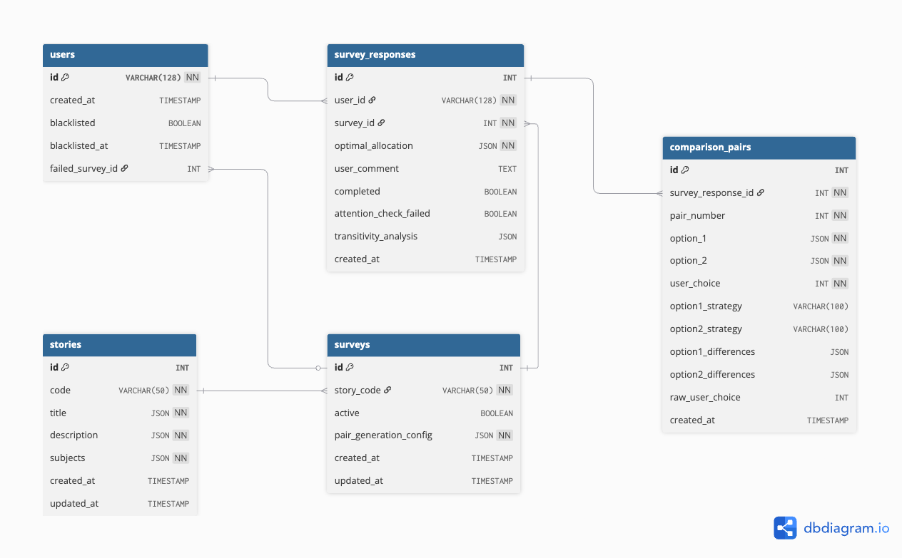

# Budget Survey Application

## Table of Contents

- [Overview](#overview)
- [Features](#features)
  - [Automatic Budget Rescaling](#automatic-budget-rescaling)
  - [Pair Generation Strategies](#pair-generation-strategies)
  - [Language Support](#language-support)
  - [Attention Check Handling](#attention-check-handling)
- [Prerequisites](#prerequisites)
- [Installation](#installation)
- [Database Setup](#database-setup)
  - [Method 1: Manual Setup using MySQL Client](#method-1-manual-setup-using-mysql-client)
  - [Method 2: Using Docker Compose](#method-2-using-docker-compose)
- [Running the Application](#running-the-application)
- [Endpoints](#endpoints)
  - [Main Routes](#main-routes)
  - [API Endpoints](#api-endpoints)
- [Screen Text Locations](#screen-text-locations)
- [Database](#database)
- [Modifying the Survey](#modifying-the-survey)
  - [Changing the Active Survey](#changing-the-active-survey)
  - [Adding or Modifying Surveys](#adding-or-modifying-surveys)
  - [Changing Strategy Names and Colors](#changing-strategy-names-and-colors)
  - [Modifying Awareness Questions](#modifying-awareness-questions)
- [Algorithm](#algorithm)
- [Analysis](#analysis)
  - [Running the Analysis](#running-the-analysis)
  - [Generating the Survey Report](#generating-the-survey-report)
  - [Key Components and Functions](#key-components-and-functions)
  - [Generated Files](#generated-files)
  - [Table Explanations](#table-explanations)
- [Testing](#testing)
  - [Test Structure](#test-structure)
  - [Running Tests](#running-tests)
    - [Quick Start](#quick-start)
    - [Test Categories](#test-categories)
      - [Analysis Tests](#analysis-tests)
      - [API Tests](#api-tests)
      - [Database Tests](#database-tests)
      - [Unit Tests](#unit-tests)
      - [UI Tests](#ui-tests)
      - [Load Testing](#load-testing)
- [Development](#development)

## Overview
This project aims to collect data to develop an algorithm for optimal budget calculations, considering the votes of many users. Users allocate money among a few subjects, creating their optimal allocation. They then compare ten pairs of options, optimizing for difference and ratio against their optimal allocation.

## Features

### Automatic Budget Rescaling
The application includes an automatic rescaling feature that helps users create valid budget allocations:

- **Purpose**: Helps users adjust their budget allocations to:
  - Sum to exactly 100
  - Ensure all numbers are divisible by 5
  - Maintain relative proportions between departments

- **How it works**:
  1. Proportionally adjusts non-zero values to sum to 100
  2. Rounds each value to the nearest multiple of 5
  3. Makes final adjustments to ensure the total remains exactly 100
  4. Maintains a minimum value of 5 for any non-zero allocation
  5. Preserves zero allocations (does not rescale them)

- **Button States**:
  The "Rescale" button becomes disabled when:
  - The total sum is already exactly 100
  - All values are zero
  - Any input contains invalid numbers
  - The total is zero

- **Constraints**:
  - Requires at least two departments with non-zero allocations
  - Maintains relative proportions between original values as closely as possible while satisfying the constraints

Users can trigger rescaling at any time using the "Rescale" button in the budget allocation interface.

### Pair Generation Strategies

The application uses the Strategy pattern to support multiple pair generation algorithms. Each survey can be configured with its own pair generation strategy.

#### Available Strategies

1. **Optimization Metrics Strategy**
   - Strategy name: `optimization_metrics`
   - Generates pairs that force users to choose between minimizing sum of differences and maximizing minimal ratio
   - Each pair contains two non-ideal allocations where one is better in terms of sum of differences while the other is better in terms of minimal ratio
   - Parameters:
     - `num_pairs`: Number of pairs to generate (default: 10)
   - Example:
     ```python
     # User's ideal: (60, 20, 20)
     # Option 1: (40, 30, 30)  Better minimal ratio (0.67) but worse sum of differences (40)
     # Option 2: (70, 15, 15)  Better sum of differences (20) but worse minimal ratio (0.75)
     ```

2. **Weighted Vector Strategy**
   - Strategy name: `weighted_average_vector`
   - Generates pairs by combining user's ideal vector with random vectors using weighted averages
   - Each pair contains:
     - A random vector different from user's ideal allocation
     - A weighted combination of the random vector and user's ideal allocation
   - Weighting pattern:
     - Starts with 10% user vector, 90% random vector
     - Gradually increases user vector weight by 10% each round
     - Includes two pairs at 50-50 weight
     - Ends with 100% user vector weight
   - Parameters:
     - `num_pairs`: Number of pairs to generate (default: 10)
   - Example:
     ```python
     # For user_vector = [20, 30, 50]:
     # Round 1: x=0.1, y=0.9
     # - Random vector: [40, 40, 20]
     # - Weighted result: [38, 39, 23] (40*0.9 + 20*0.1, 40*0.9 + 30*0.1, 20*0.9 + 50*0.1)
     ```

3. **Rounded Weighted Vector Strategy**
   - Strategy name: `rounded_weighted_average_vector`
   - Extends the Weighted Vector Strategy to ensure all allocations are multiples of 5
   - Each pair contains:
     - A random vector different from user's ideal allocation (in multiples of 5)
     - A weighted combination rounded to multiples of 5
   - Maintains all weighting patterns from the parent strategy
   - Parameters:
     - `num_pairs`: Number of pairs to generate (default: 10)
   - Example:
     ```python
     # For user_vector = [60, 25, 15]:
     # With x_weight = 0.3:
     # - Random vector: [30, 45, 25]
     # - Before rounding: [39, 39, 22] (30*0.7 + 60*0.3, 45*0.7 + 25*0.3, 25*0.7 + 15*0.3)
     # - After rounding to multiples of 5: [40, 40, 20]
     ```

4. **Root Sum Squared Sum Strategy**
   - Strategy name: `root_sum_squared_sum`
   - Compares root of sum of squared differences vs regular sum of differences
   - Each pair contains two non-ideal allocations where one is better in terms of root sum squared differences while the other is better in terms of regular sum of differences
   - Parameters:
     - `num_pairs`: Number of pairs to generate (default: 10)
   - Example:
     ```python
     # User's ideal: (50, 25, 25)
     # Option 1: (25, 70, 5)  Better root sum squared (55.23) but worse sum differences (90)
     # Option 2: (10, 25, 65)  Better sum differences (80) but worse root sum squared (56.57)
     ```

5. **Root Sum Squared Ratio Strategy**
   - Strategy name: `root_sum_squared_ratio`
   - Compares root of sum of squared differences vs minimal ratio
   - Each pair contains two non-ideal allocations where one is better in terms of root sum squared differences while the other is better in terms of minimal ratio
   - Parameters:
     - `num_pairs`: Number of pairs to generate (default: 10)
   - Example:
     ```python
     # User's ideal: (60, 25, 15)
     # Option 1: (50, 30, 20)  Better minimal ratio (0.83) but worse root sum squared (12.25)
     # Option 2: (65, 25, 10)  Better root sum squared (7.07) but worse minimal ratio (0.67)
     ```

6. **Extreme Vectors Strategy**
   - Strategy name: `extreme_vectors`
   - Tests user preferences between extreme allocations and their weighted combinations with the ideal vector
   - Generates two types of pairs:
     - Extreme vector pairs: Each extreme vector allocates 100% to one department
     - Weighted average pairs: Combines user's ideal vector with extreme vectors using weights of 25%, 50%, and 75%
   - Parameters:
     - `num_pairs`: Number of pairs to generate (default: 9)
   - Example:
     ```python
     # For vector_size=3 and user_vector = [70, 20, 10]:
     
     # Extreme pairs:
     # [100, 0, 0] vs [0, 100, 0]
     # [100, 0, 0] vs [0, 0, 100]
     # [0, 100, 0] vs [0, 0, 100]
     
     # Weighted average pairs (50% weight):
     # [85, 10, 5] vs [35, 60, 5] (weighted averages with [100,0,0] and [0,100,0])
     ```
   - Purpose: Tests the hypothesis that if a user prefers extreme vector A over extreme vector B, they will also prefer weighted averages that incorporate extreme vector A over those with extreme vector B

#### Adding New Strategies

To add a new pair generation strategy:

1. Create a new file in `application/services/pair_generation/` (e.g., `new_strategy.py`):
```python
from application.services.pair_generation.base import PairGenerationStrategy

class NewStrategy(PairGenerationStrategy):
    def generate_pairs(self, user_vector: tuple, n: int, vector_size: int):
        # Implement your pair generation logic here
        pass
        
    def get_strategy_name(self):
        return "new_strategy_name"
```

2. Register the strategy in `application/services/pair_generation/__init__.py`:
```python
from .new_strategy import NewStrategy
StrategyRegistry.register(NewStrategy)
```

For examples of how to configure surveys to use different strategies, see the [Adding or Modifying Surveys](#adding-or-modifying-surveys) section.

### Language Support
The application provides comprehensive bilingual support:

- **Available Languages**:
  - Hebrew (default)
  - English

- **Key Features**:
  - Language switcher in the UI header
  - Automatic RTL layout for Hebrew
  - LTR layout for English
  - Language preference persistence across sessions
  - Fallback to Hebrew for missing translations

- **Translation Coverage**:
  - User interface elements
  - Error messages
  - Survey questions and instructions
  - Survey subjects (e.g., ministry names)
  - System messages and alerts
  - Button labels and tooltips
  - Form validations
  - Success/failure notifications

- **How to Switch Languages**:
  - Via UI: Click the language toggle in the top-right corner
  - Via URL: Add 'lang' parameter to the URL
    - For Hebrew: `?lang=he`
    - For English: `?lang=en`
    - Example: `https://survey.csariel.xyz/?userID=abc&surveyID=123&lang=en`
  - Selection is remembered for future visits
  - Can be changed at any point during the survey

All translations are managed through the translations system, making it easy to maintain and update content in both languages.

### Attention Check Handling
The application includes an attention check mechanism to ensure survey quality:

- **Purpose**: Validate user attention during survey completion
- **Implementation**:
  - Two attention check questions mixed within comparison pairs
  - Validates that users recognize their own optimal allocation
  - Failed checks are recorded and do not allow retries

- **Panel4All Integration**:
  - Sends "attentionfilter" status for failed attention checks
  - Sends "finish" status for successful completions
  - Allows proper handling by survey management system

- **Data Storage**:
  - Failed checks are stored with `attention_check_failed` flag
  - Maintains data for analysis while excluding from main results
  - Supports research on survey response quality

## Prerequisites
- Python 3.8+
- MySQL 8.0+
- pip
- virtualenv
- Docker (optional, only if you prefer to use Docker for database setup)

## Installation

1. Clone the repository:
   ```
   git clone https://github.com/ariel-research/budget-survey
   cd budget-survey
   ```

2. Create and activate a virtual environment:
   ```
   python -m venv venv
   source venv/bin/activate
   ```

3. Install dependencies:
   ```
   pip install -r requirements.txt
   ```

4. Set up the MySQL database (see Database section below)

5. Create a `.env` file in the project root and add the necessary environment variables (see `.env.example` for reference)

## Database Setup

You can set up the database using one of two methods:

### Method 1: Manual Setup using MySQL Client

1. Connect to your MySQL server using the MySQL client.

2. Create a new database:

   ```sql
   CREATE DATABASE survey;
   ```

3. Use the newly created database:

   ```sql
   USE survey;
   ```

4. Run the SQL commands from the database/schema.sql file to create the necessary tables and structure:


  ```
  
  ```

### Method 2: Using Docker Compose

1. Ensure you have Docker and Docker Compose installed on your system.

2. Navigate to the project root directory where the docker-compose.yml file is located.

3. Run the following command to start the MySQL container and set up the database:

   ```
   docker-compose up -d db
   ```

This will create a MySQL container, create the database, and run the initialization script (`database/schema.sql`) to set up the necessary tables and structure.

Note: Make sure your .env file is properly configured with the correct database connection details before running either method.

## Running the Application

1. Activate the virtual environment (if not already activated)

2. Run the Flask application using either of these commands:
   ```
   python app.py
   ```
   This will run the application on port 5001.

   or
   ```
   flask run
   ```
   This will run the application on port 5000.

3. Access the application based on the command used:
   - If using `python app.py`: http://localhost:5001
   - If using `flask run`: http://localhost:5000

## Endpoints

### Main Routes
1. Dashboard (Main Landing Page)
   - `/` - Analytics dashboard (Main landing page)
   
2. Survey Taking
   - `/take-survey/?userID=...&surveyID=...` - Take survey (with default survey ID)
   - `/take-survey/?userID=...&surveyID=...&internalID=N` - Take survey with specific internal ID
   - `/take-survey/create_vector` - Create budget allocation
   - `/take-survey/survey` - Compare budget pairs
   - `/take-survey/thank_you` - Survey completion page

3. Analysis & Reports
   - `/report` - View survey analysis report (PDF)
     * Automatically refreshes based on latest data
     * Updates CSVs and PDF as needed
     * Shows PDF in browser with download option
   - `/dev/report` - Development report for testing
     * Always generates fresh report
     * Useful for testing template changes
     * Creates 'survey_analysis_report_dev.pdf'

4. Survey Results
   - `/surveys/responses` - View all responses across all surveys
   - `/surveys/{survey_id}/responses` - View responses for specific survey
   - `/surveys/users/{user_id}/responses` - View all responses from specific user
   - `/surveys/{survey_id}/users/{user_id}/responses` - View specific user's response for a survey
   - `/surveys/comments` - View all comments
   - `/surveys/{survey_id}/comments` - View comments for specific survey

### API Endpoints
- `/get_messages` - Returns JSON dictionary of error messages

Notes: 
- For survey taking endpoints, both 'userID' and 'surveyID' parameters are required
- The 'surveyID' parameter in the URL is required but not used internally
- The survey ID is determined by either:
  1. Custom internal survey ID via `internalID` parameter
  2. Default survey ID from config file

## Live Application Endpoints

1. Dashboard
   - Dashboard (Main landing page): https://survey.csariel.xyz/

2. Survey Taking
   - Default survey: <https://survey.csariel.xyz/take-survey/?userID=...&surveyID=...>
   - Custom survey: <https://survey.csariel.xyz/take-survey/?userID=...&surveyID=...&internalID=N>

3. Analysis & Reports
   - Survey Report: https://survey.csariel.xyz/report
   - Development Report: https://survey.csariel.xyz/dev/report

4. Survey Results
   - All Responses: https://survey.csariel.xyz/surveys/responses
   - Survey Responses: https://survey.csariel.xyz/surveys/{survey_id}/responses
   - User Responses: https://survey.csariel.xyz/surveys/users/{user_id}/responses
   - User Survey Response: https://survey.csariel.xyz/surveys/{survey_id}/users/{user_id}/responses
   - All Comments: https://survey.csariel.xyz/surveys/comments
   - Survey Comments: https://survey.csariel.xyz/surveys/{survey_id}/comments

Notes:
- URL parameters required for survey taking:
  * userID: Required for user identification
  * surveyID: Required but not used internally
  * internalID: Optional, overrides default survey ID from config

## Live Application Update

To update the live application after code changes:

* Log into the server (ssh survey@csariel.xyz)
* Inside the `app` folder, do `git pull`
* `sudo myservice status` - check that the service is running;
* `sudo myservice restart`

## Screen Text Locations
To modify the text displayed on each screen of the application, here's a guide to which files contain the text for each screen:

1. **Translations**
   - File: `application/translations.py`
   - Contains all translatable text in both Hebrew and English
   - Includes both user interface text and error messages
   - Organized in sections: "messages" for errors, "survey" for UI text

2. **Templates**
   - All templates use translation keys instead of hardcoded text
   - Hebrew is the default language
   - Templates automatically handle RTL/LTR based on selected language
   - Files:
     * Survey Taking:
       - `templates/index.html` - Landing/consent page
       - `templates/create_vector.html` - Budget allocation
       - `templates/survey.html` - Pair comparisons
       - `templates/thank_you.html` - Completion page
     * Survey Results:
       - `templates/dashboard/surveys_overview.html` - Dashboard view
       - `templates/responses/list.html` - All responses
       - `templates/responses/detail.html` - Survey responses
       - `templates/responses/user_detail.html` - User responses
     * Common:
       - `templates/error.html` - Error pages

Note: Dynamic content (survey name, subjects) is loaded from the database in the appropriate language based on user preference.


## Database
The application uses a MySQL database with multilingual support. Here's the schema:



## Modifying the Survey

### Changing the Active Survey
To modify the survey that users will get, you need to manually update the `SURVEY_ID` value in the file [`config.py`](config.py). Look for the following line and change the number to the desired survey ID:

```python
SURVEY_ID = 1  # Change this to the desired survey ID
```

### Adding or Modifying Surveys
To add new surveys or modify existing ones, follow these steps:

1. Connect to the database on the remote server using MySQL Workbench via SSH:
   - Create a new connection
   - Choose "Standard TCP/IP over SSH" as the connection method
   - SSH Hostname: [your_server_address]
   - SSH Username: [your_ssh_username]
   - SSH Password: [your_ssh_password] (or use SSH Key File)
   - MySQL Hostname: 127.0.0.1
   - MySQL Server Port: 3306
   - Username: [your_mysql_username]
   - Password: [your_mysql_password]

2. Once connected, you can run SQL queries to add or modify surveys. Here are some example queries:

   First, add a new story (if needed):
   ```sql
   INSERT INTO stories (
       code,
       title,
       description,
       subjects
   )
   VALUES (
       'budget_2024',
       JSON_OBJECT(
           'he', 'סקר תקציב 2024',
           'en', 'Budget Survey 2024'
       ),
       JSON_OBJECT(
           'he', 'סקר שנתי להקצאת תקציב',
           'en', 'Annual budget allocation survey'
       ),
       JSON_ARRAY(
           JSON_OBJECT('he', 'בריאות', 'en', 'Health'),
           JSON_OBJECT('he', 'חינוך', 'en', 'Education'),
           JSON_OBJECT('he', 'ביטחון', 'en', 'Defense')
       )
   );
   ```

   Then, add a new survey that uses this story:
   ```sql
   INSERT INTO surveys (
       story_code,
       active,
       pair_generation_config
   )
   VALUES (
       'budget_2024',
       TRUE,
       JSON_OBJECT(
           'strategy', 'extreme_vectors',
           'params', JSON_OBJECT('num_pairs', 10)
       )
   );
   ```

   Modify an existing story's content:
   ```sql
   UPDATE stories
   SET title = JSON_OBJECT(
           'he', 'סקר תקציב מעודכן 2024',
           'en', 'Updated Budget Survey 2024'
       ),
       description = JSON_OBJECT(
           'he', 'סקר שנתי מעודכן להקצאת תקציב',
           'en', 'Revised annual budget allocation survey'
       ),
       subjects = JSON_ARRAY(
           JSON_OBJECT('he', 'בריאות', 'en', 'Health'),
           JSON_OBJECT('he', 'חינוך', 'en', 'Education'),
           JSON_OBJECT('he', 'ביטחון', 'en', 'Defense')
       )
   WHERE code = 'budget_2024';
   ```

   Update just the pair generation strategy for a survey:
   ```sql
   UPDATE surveys
   SET pair_generation_config = JSON_OBJECT(
       'strategy', 'optimization_metrics',
       'params', JSON_OBJECT('num_pairs', 10)
   )
   WHERE id = 1;
   ```

   Deactivate a survey:
   ```sql
   UPDATE surveys
   SET active = FALSE
   WHERE id = 1;
   ```

Remember to:
- Use valid strategy names as defined in the pair generation strategies
- Include all required parameters for the chosen strategy
- Update the `SURVEY_ID` in `config.py` after adding or modifying surveys
- Ensure that story codes are unique across the stories table

### Changing Strategy Names and Colors

To change a strategy's name or color, you'll need to update both code and database references.

#### Changing a Strategy Name

1. **Update the Strategy Class**:
   - Open the strategy file in `application/services/pair_generation/` (e.g., `optimization_metrics_vector.py`)
   - Modify the `get_strategy_name()` method:
     ```python
     def get_strategy_name(self) -> str:
         """Get the unique identifier for this strategy."""
         return "new_strategy_name"  # Changed from original name
     ```

2. **Update the Database**:
   - Update all surveys using this strategy with this SQL query:
     ```sql
     UPDATE surveys 
     SET pair_generation_config = JSON_REPLACE(
         pair_generation_config, 
         '$.strategy', 
         'new_strategy_name'
     ) 
     WHERE id = 1;  # Replace with the survey ID
     ```
   - To update multiple surveys:
     ```sql
     UPDATE surveys 
     SET pair_generation_config = JSON_REPLACE(
         pair_generation_config, 
         '$.strategy', 
         'new_strategy_name'
     ) 
     WHERE id IN (1, 4, 6);  # List all affected survey IDs
     ```

#### Changing a Strategy Color

Strategy badge colors are defined in CSS:

1. Open `application/static/css/dashboard_style.css`
2. Find the Strategy Badge Colors section:
   ```css
   .strategy-badge[data-strategy="optimization_metrics"] { 
       background: var(--color-primary);
   }
   ```
3. Modify the color using predefined variables or custom colors:
   ```css
   /* Using predefined colors */
   .strategy-badge[data-strategy="new_strategy_name"] { 
       background: var(--color-purple);  /* Choose from available colors */
   }
   
   /* OR using custom HEX color */
   .strategy-badge[data-strategy="new_strategy_name"] { 
       background: #4A5568;  /* Custom gray color */
   }
   ```

4. Available color variables include:
   - `--color-primary` (Blue)
   - `--color-success` (Green)
   - `--color-purple` (Purple)
   - `--color-orange` (Orange)
   - `--color-teal` (Teal)
   - `--color-indigo` (Indigo)
   - `--color-rose` (Rose)
   - `--color-amber` (Amber)

### Modifying Awareness Questions

To modify the awareness check questions in the survey:

1. **Change the Question Text**:
   - Open `application/translations.py`
   - Locate and modify the awareness question text in both languages:
     ```python
     "awareness_question": {
         "he": "בחר באפשרות מספר 1. זוהי שאלת בדיקת תשומת לב.",
         "en": "Please select option 1. This is an attention check question.",
     },
     ```

2. **Change the Answer Options or Expected Answers**:
   - Open `application/services/awareness_check.py`
   - Modify the `generate_awareness_questions` function to change how options are created
   - Open `application/schemas/validators.py`
   - Update the validation logic in the `SurveySubmission.validate()` method:
     ```python
     # Change which answers are expected
     if (
         len(self.awareness_answers) != 2
         or self.awareness_answers[0] != 1  # First check must be 1
         or self.awareness_answers[1] != 2  # Second check must be 2
     ):
     ```

## Algorithm
The core algorithm of this application is implemented in the `generate_user_example` function. The function generates a graph based on the user's optimal budget allocation, creating comparison pairs that optimize for both difference and ratio.

## Analysis

The project includes an 'analysis' package that processes the collected survey data and generates insightful statistics and reports. This package is crucial for understanding user responses and deriving meaningful conclusions from the survey data.

### Running the Analysis

To run the survey analysis, use the following command from the project root directory:

```
python -m analysis.survey_analysis
```

### Generating the Survey Report

To generate a comprehensive PDF report of the survey results, use the following command from the project root directory:

```
python -m analysis.survey_report_generator_pdf
```

This command will create a PDF report named 'survey_analysis_report.pdf' in the 'data' directory. The report includes:

- Executive summary
- Overall survey participation statistics
- Visualizations of algorithm preferences:
  - Per-survey answer percentages
  - User survey majority choices
  - Overall majority choice distribution
  - Total answer percentage distribution
- Detailed survey-wise analysis
- Individual participant analysis
- Key findings and conclusions
- Methodology description

### Key Components and Functions

The analysis package consists of several key components:

1. Data Retrieval and Processing:
   - `get_all_completed_survey_responses()`: Retrieves and processes all completed survey responses from the database.

2. Statistical Analysis:
   - `generate_survey_optimization_stats(df)`: Generates optimization statistics for all survey responses.
   - `summarize_stats_by_survey(df)`: Summarizes statistics by survey ID, including a total summary row.

3. Report Generation:
   - `generate_report()`: Orchestrates the entire report generation process, including data loading, analysis, visualization, and PDF creation.
   - Various functions for generating specific report sections (e.g., executive summary, survey analysis, visualizations).

4. Visualization:
   - Multiple functions for creating charts and graphs to visualize survey results and trends.

For a complete list of functions and their descriptions, please refer to the source code in the `analysis` directory.
### Generated Files

The analysis scripts generate the following files in the `data` directory:

1. **all_completed_survey_responses.csv**: Raw data of all completed survey responses.
2. **survey_optimization_stats.csv**: Optimization statistics for each survey response.
3. **summarize_stats_by_survey.csv**: Aggregated statistics for each survey and overall summary.
4. **survey_analysis_report.pdf**: Comprehensive PDF report of survey results and analysis.

### Table Explanations

1. **All Completed Survey Responses**
   - Each row represents a single comparison pair from a completed survey.
   - Includes survey ID, user ID, optimal allocation, and details of each comparison pair.

2. **Survey Optimization Stats**
   - Each row represents a completed survey response.
   - Shows the number of sum-optimized and ratio-optimized choices for each response.

3. **Summarize Stats by Survey**
   - Each row represents aggregate data for a single survey, with a final row summarizing across all surveys.
   - Includes metrics such as unique users, total answers, and percentages of sum/ratio optimized choices.

Remember to regularly run both the analysis script and the report generator to keep these statistics and reports up-to-date as new survey responses are collected.

## Testing

The project includes comprehensive test coverage across multiple testing domains. All tests are located in the `tests/` directory.

### Test Structure
```python
tests/
├── analysis/                     # Data analysis and reporting tests
│   ├── utils/
│   │   ├── test_analysis_utils.py
│   │   ├── test_file_utils.py
│   │   └── test_visualization_utils.py
│   ├── test_report_content_generators.py
│   ├── test_survey_analysis.py
│   └── test_survey_report_generator.py
├── api/                         # API endpoint tests
│   └── test_routes.py
├── database/                    # Database integration tests
│   └── test_database_integration.py
├── performance/                 # Load and performance tests
│   └── load_test.py
├── services/                    # Service layer tests
│   └── test_survey_vector_generator.py
├── UI/                         # Frontend/UI tests
│   └── test_client_side.py
```

### Running Tests

#### Quick Start
Run all tests:
```bash
pytest
```

#### Test Categories

##### Analysis Tests
**Description:** Data processing and reporting
```bash
pytest tests/analysis/
```

##### API Tests
**Description:** Endpoint functionality and error handling
```bash
pytest tests/api/
```

##### Database Tests
**Description:** Data persistence and integrity
```bash
pytest tests/database/
```

##### Unit Tests
**Description:** Core algorithms and utilities
```bash
pytest tests/unit/
```

##### UI Tests
**Description:** Frontend functionality
```bash
pytest tests/UI/
```

##### Load Testing
**Description:** Performance and scalability testing
We use Locust for performance testing. The load tests simulate realistic user behavior patterns.

To run the load test, follow these steps:

1. Start your application server if it's not already running.

2. Run Locust in headless mode using the following command:

```
locust -f tests/performance/load_test.py --headless -u 100 -r 2 -t 1m --host=[your host]
```

Replace `[your host]` with the appropriate host address (e.g., `http://localhost:5001`).

This command does the following:
- `-f tests/performance/load_test.py`: Specifies the Locust file to use
- `--headless`: Runs Locust in headless mode (no web UI)
- `-u 100`: Simulates 100 users
- `-r 10`: Spawns 2 users per second
- `-t 5m`: Runs the test for 1 minute
- `--host=[your host]`: Specifies the host to load test

3. Locust will run the test and output the results to the console. You'll see real-time statistics including request counts, response times, and failure rates.

4. After the test is completed, Locust will generate a summary of the test results in the console output.

Note: It's crucial to have your application server running before starting the Locust test. The load test will attempt to interact with your live application, so an active server is necessary for accurate results.

## Development
- Use the provided `.pre-commit-config.yaml` for code formatting and linting
- Run tests using `pytest`
- Logs are stored in the `logs` directory
- Database migrations are stored in `migrations/` directory
- Follow the timestamp-based naming convention (e.g., `20250216_add_attention_check_column.sql`)
